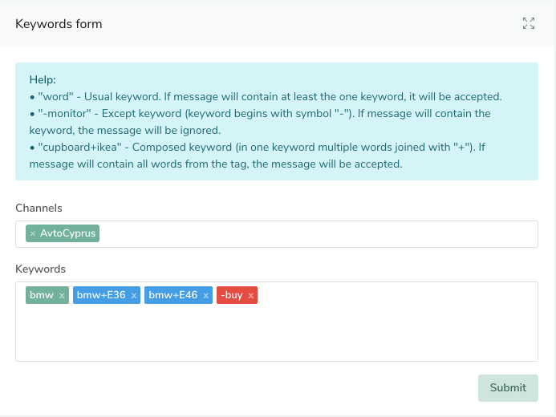

# Telegram-notification (experimental version)

Main goal of the app to notificate about new messages that correspond to keywords that you will create for selected chats.
The application uses NLP (Tokenization, Stemming, and Lemmatization processes) for compare keywords and message.
The application uses real telegram client (not bot, for grabbing information from chats) + bot for sending notifications. 

## How it works?
For subscribing messages from telegram channels(chats) you should create keywords for selected channels.
When a new message appears in the desired channel, it is checked for matching keywords.

1. Login via Telegram to the app.
2. Create necessary keywords:

3. When a new message appears in the desired channel you will receive forwarded message from bot.

## AWS DynamoDB

The app uses AWS DynamoDB for storing keywords, channels and users (base info from telegram).
There is migration file ([see app/app/migrations.py file](app/app/migrations.py) ) for infrastructure.

## Build and deploy using Skaffold

The simplest way to run the app is to run in kubernetes env using preconfigured skaffold.

1. Install kubernetes environment for example in Digital Ocean (https://www.digitalocean.com/products/kubernetes/).
1. Configure context `kubectl` on local machine for the kubernetes Digital Ocean environment.
1. (optional) Install free TLS certificates Let's Encrypt. See `staging_issuer` and `prod_issuer` in `.skaffold/prod directory`
```
kubectl apply -f .skaffold/prod/staging_issuer.yaml
```
1. Create real telegram user client
1. Create real telegram bot
1. Generate user client token ([see app/app/cli/generate_token.py file](app/app/cli/generate_token.py) )
1. Create `secrets.values.yaml` based on `secrets.values.yaml.dist` and fill it using secret info from telegram.
1. Replace `registry.digitalocean.com/DO_REGISTRY/telegram` in `.skaffold.yaml` on your path to container registry.
1. Run build an image and deploy using command:
```
skaffold run -p prod -f .skaffold/skaffold.yaml
```
